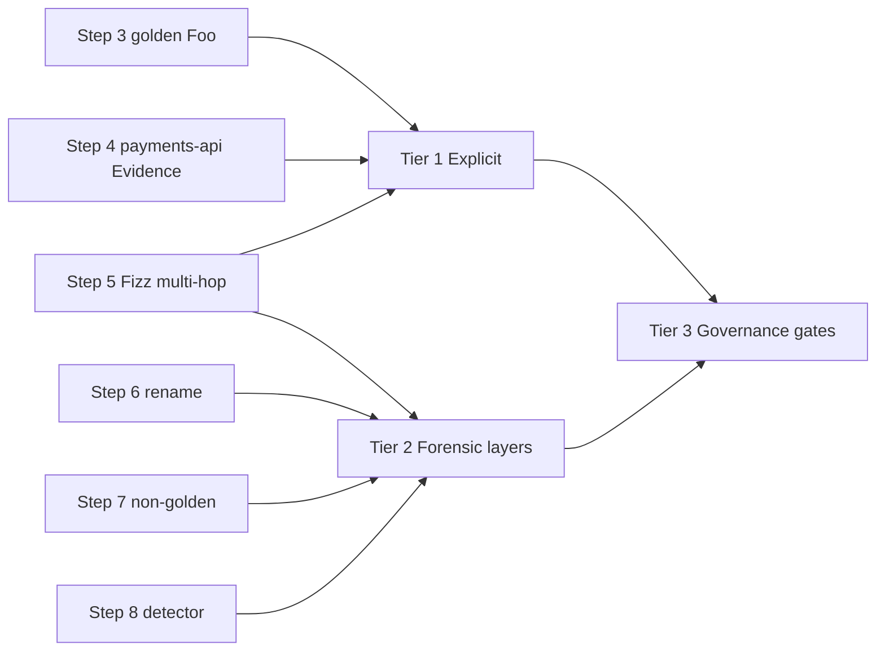

# Docker Image Lineage — Findings

**Audience:** Solutions Architect notes for enterprise Docker lineage / golden-image provenance on the JFrog Platform  
**Lab instance:** `https://tomjpd2.jfrog.io`  
**Lab repo:** `lineage-docker-local`

## Executive answer

**Yes — Artifactory can help preserve and expose provenance for container images, including after rename**, but not by reading a durable `FROM` name out of the image alone.

Renaming an image does **not** change content digests or layer digests. Lineage is solvable with a layered model:

1. **Explicit provenance** when CI publishes Build Info and/or Evidence (best; start here).
2. **Layer-chain inference** against a golden catalog when teams do not cooperate (practical forensic answer—**scopes the issue**, not the long-term system of record).
3. **Governance gates** (Evidence / AppTrust policies, repo permissions) for “must have been built on golden” (AppTrust when available; Evidence still valuable without it).

**Compliant Version Selection (CVS) is not the product for this use case.** CVS substitutes compliant library package versions at resolve time (npm, Maven, PyPI, …). It does not answer “what base image did this Docker image come from?” Docker Curation/on-demand scanning is complementary security control, not lineage.

Signing is useful for **integrity** of attestations; it is not required to answer the rename/lineage question via layer digests.

---

## Capability matrix

| Signal | Survives rename? | Identifies golden base? | Notes |
|---|---|---|---|
| OCI / Docker **layer digests** (manifest `layers[].digest`) | Yes | Heuristic: golden layer chain is a **prefix** of child | Best *passive* signal; fails on squash, rebase, or `FROM scratch` + copy |
| OCI config `history` / `docker history` | Yes (in config blob) | Weak | Records build commands, not `repo/name:tag` of the base |
| **Build Info** (`jf docker push --build-name/--build-number` + `jf rt build-publish`) | Yes (digest-tied) | Strong **if** base collected as dependency / CI records it | Bare `docker push` without CLI build-info flags yields little lineage |
| **Evidence** / SLSA / OCI attestations (`jf evd create`, cosign, GHA attest → Evidence Collection) | Yes | Strong when predicate lists base digest | Best *explicit* provenance; external evidence needs Enterprise+ |
| **Xray SBOM** (`jf docker scan --sbom`, component graph) | Yes | Weak / indirect | Package inventory ≠ base image identity |
| Artifact **properties** / image **labels** set in CI | Yes if set on digest | Strong if enforced | Operational overlay; not automatic |
| Image **name / tag** | No (that is the rename) | Insufficient | Do not key lineage on name alone |
| Dockerfile `FROM` string in the registry | N/A | Not stored in OCI config | Must come from build system or attestation |
| **Compliant Version Selection** | N/A | No | Wrong tool for Docker base-image lineage |

### Critical OCI fact

After push/pull, registries do **not** reliably retain a human-readable parent image name. Legacy Docker `Parent` IDs are not a dependable OCI registry signal. Durable signals are:

- content-addressed **layer chains**
- **attestations** (Evidence / SLSA / in-toto)
- **Build Info** metadata published by CI

---

## Recommended architecture (three tiers)

### Tier 1 — Explicit lineage (governed path)

CI contract for every image published to local Docker repos:

1. Pull the golden base from Artifactory (pin by digest).
2. Build the app image (or build from an intermediate that itself traces to golden).
3. `jf docker push … --build-name --build-number` then `jf rt build-publish`.
4. Attach Evidence with a lineage predicate including child digest, **immediate** base name + digest, and preferably **`root_golden_digest`** (or tooling must walk parent Evidence until a golden catalog hit). Include pipeline ID (`jf evd create`).
5. Prefer BuildKit / GitHub provenance attestations so OCI attestations can land in Evidence Collection where licensed.

**Multi-hop:** if Fizz only records `base=payments-api`, answering “is the root golden?” requires walking Evidence payments-api→golden-base **or** storing `root_golden_digest` on every hop.

**Golden catalog:** store approved bases in a dedicated Docker local (or promoted tags) with:

- property `golden.image=true`
- Build Info
- Evidence predicate marking the image as an approved base

### Tier 2 — Forensic lineage (non-cooperating teams)

For any image in a local Docker repo:

1. Read manifest / config layer DiffIDs (ordered).
2. Compare to the golden catalog.
3. If any golden image’s layer list is a **prefix** of the candidate → derived from that golden (**even if renamed**, and **even if multi-hop** as long as layers were not squashed).
4. Else → not built on a known golden (or squashed / unknown).

This is the practical answer to “we renamed the image — can we still tell?” and to “Fizz was built from payments-api, not directly from golden-base.”

**Lab validated:** DiffID prefix alone correctly classifies renamed `billing-service` as derived-from-golden with **no** Evidence on that path (`DERIVED_FROM_GOLDEN (layer prefix)`).

#### Why DiffID prefix is not the ideal primary solution

Tier 2 proves the problem is **technically solvable from content alone**. It is **not** the recommended operating model at enterprise scale.

| Shortcoming | Detail |
|---|---|
| Forensic, not governed | Prefix matching reconstructs ancestry from bytes. It does not prove a signed CI decision, an approved-base policy, or who was allowed to publish. |
| Large custom build | You must maintain a golden DiffID catalog, extract DiffIDs for every candidate image, run matching at scale, handle inconclusive cases, and own the tooling—a platform program, not a product checkbox. |
| Fragile on real builds | Squash, some rebuild/rebase flows, exotic inheritance, and multi-arch/index edge cases erase or obscure the prefix. “No match” often means **inconclusive**, not a clean policy failure. |
| Weak lifecycle hooks | DiffID compare yields a report. It does not give a native promote/release control plane tied to package lifecycle. |
| Weaker audit posture | Signed Evidence is durable and platform-queryable. A DiffID script is a later reconstruction that is harder to standardize and defend in audit. |

**Positioning:** use DiffIDs to **scope the issue** and as a **backstop** when teams skip CI metadata—not as the system of record.

### Tier 3 — Governance (“should have been golden”)

- Restrict which bases teams may pull (permissions + approved golden repos).
- AppTrust / Unified Policy **evidence gates** requiring a lineage/SLSA predicate before promote/release.
- Xray watches for vulnerability posture on non-golden paths (consequence, not proof).
- Curation for Docker scanning/blocking as complementary control — **not CVS**.

### Phased path: Evidence now, AppTrust when ready

Customers may have **Evidence Collection today** without AppTrust yet. That still supports a strong interim state:

1. **Now (Evidence available):** Make lineage an explicit CI contract—digest-pinned `FROM`, Build Info, and **signed derived-from Evidence** on every publish (immediate parent + preferably root golden). Query Evidence by package/digest for reviews, audits, and **manual** promote checks. Keep DiffID matching as the forensic backstop only.
2. **Later (AppTrust / Unified Policy):** Same Evidence becomes the input to **promote gates**—block release unless required lineage Evidence is present. No re-architecture of the attestation model; governance turns on against the same predicates.

**One-liner:** DiffIDs show blast radius and prove ancestry is recoverable; Evidence is the practical control to start today; AppTrust is how you enforce it later.

---

## Customer implementation checklist

What the customer must put in place for lineage to be **traceable and verifiable** (including rename and multi-hop golden-base → payments-api → fizz-service). This is the actionable roll-up of the three-tier model above—not a substitute for the lab evidence that validates it.

### 1. Platform foundations (JFrog)

- Designate **golden** Docker repos (e.g. `acmecorp-goldenimages`) and **application** Docker locals/virtuals as the system of record.
- Prefer pulls/pushes through Artifactory so digests, layers, Build Info, and Evidence stay queryable in one place.
- Enable **Evidence Collection** (Enterprise+ where required for external attestations) and register **org signing keys** for Evidence.
- Key all lineage logic on **digest**; treat name/tag as mutable labels only.

Without this, forensic layer matching may still work if binaries exist in Artifactory, but explicit provenance and promote gates will be weak.

### 2. Golden Image team contract

For every approved base published to the catalog:

1. Build and push via CI to the golden catalog; expose consumers to **digest-pinned** references (not only floating tags).
2. Publish **Build Info** (`jf docker push --build-name/--build-number` + `jf rt build-publish`).
3. Mark catalog membership (e.g. property `golden.image=true` and/or Evidence predicate "approved golden").
4. Attach signed Evidence: role = golden-base, image digest, pipeline IDs.

That catalog is the termination set for both layer-prefix matching and Evidence walks ("root is golden").

### 3. Application CI contract (every image to local Docker repos)

For every derived image (direct child **or** child-of-child):

1. **Pin base by digest** from Artifactory (`FROM …@sha256:…`), not only mutable tags.
2. Build, then push with **Build Info**.
3. Attach **lineage Evidence** on the published package/subject including at least:
   - child `image_digest`
   - immediate `base_image_ref` + `base_image_digest`
   - preferably `base_package_name` / `base_package_version` (for walks)
   - pipeline / build identifiers
   **Multi-hop:** also store `root_golden_digest` (and/or only claim `derived_from_golden: true` when verified). If CI records only the immediate parent (payments-api), tooling **must** walk Evidence until a golden catalog hit.
4. Optional searchable properties/labels (e.g. `com.acme.base.digest=…`) as an operational overlay—not a substitute for Evidence.

Bare `docker push` with no Build Info / Evidence leaves verification dependent on Tier 2 forensics only.

### 4. Two verification mechanisms (both needed)

**A. Explicit (Tier 1) — preferred for audit / promote**

- Query Evidence by package path and/or **subject digest**.
- For multi-hop: **walk** parent digests/package coords until golden catalog hit, **or** require `root_golden_digest` on every hop.
- Prefer digest-keyed Evidence queries so **rename** does not orphan provenance (Evidence does not auto-copy to a new tag).
- When multiple Evidence records exist on one path, prefer the predicate matching the current image digest (or newest `createdAt`).

**B. Forensic (Tier 2) — when CI skipped Evidence / after rename**

- Maintain the golden catalog's ordered **layer DiffIDs** (or compressed layer digests—one digest family only).
- For any candidate: if a golden layer chain is a **prefix** of the candidate's layers → derived from that golden (rename-safe and multi-hop-safe when layers are not squashed).
- Fail closed on squash / rebase / `FROM scratch` copy-only finals → fall back to Tier 1.

### 5. Detection / tooling to build or buy

A script, Worker, internal service, or gated pipeline step that can:

1. Resolve image → digests + ordered layer list (Registry API, Artifactory storage, AQL / checksum search, and/or OneModel `storedPackages` by sha256).
2. Compare layer prefix to the golden catalog.
3. Fetch Evidence and walk parents to golden.
4. Optionally join Build Info for CI context.
5. Emit a clear verdict: `ROOT_IS_GOLDEN` / `NOT_DERIVED` / `INCONCLUSIVE` (squash, missing catalog, missing Evidence).

### 6. Governance (Tier 3)

- Restrict which bases teams may pull (permissions / curated golden repos; mirrored Hub only where intentional).
- Before promote/release: **AppTrust / Unified Policy evidence gates** (or equivalent) requiring lineage/SLSA proof of root golden, or a passing detector result.
- Treat Xray SBOM and Curation as **security consequences**, not lineage proof.
- Do **not** use Compliant Version Selection for Docker base-image lineage.
- **Policy:** gate or ban image squashing / history-destroying rebuilds unless Tier 1 Evidence is always attached.

### 7. Process and organization

- Document the golden catalog and digest-pinning in the developer Dockerfile guide.
- Golden team and app teams may stay decoupled **only if** the CI contracts above are mandatory org standards.
- Images that land only in ACR/ECR (or other external registries): re-push/mirror into Artifactory with the same digests and attach Evidence there, **or** accept that verifiable lineage is Artifactory-centric for images that never enter the platform.

### 8. Maturity (minimum viable → full)

| Goal | Minimum to implement |
|---|---|
| "Can we tell after rename?" | Golden catalog + layer-prefix detector |
| "Can we prove in audit / promote?" | + Build Info + signed lineage Evidence (+ keys) |
| "Child-of-child still roots to golden?" | + Evidence walk **or** `root_golden_digest` on every publish |
| "Must have been golden" | + pull restrictions + Evidence/policy gates on promote |

**Bottom line:** golden catalog in Artifactory, digest-pinned builds, CI that always publishes Build Info + lineage Evidence (with multi-hop root handling), a detector (layers + Evidence walk), and promote-time gates. Signing supports integrity of Evidence; it is not the lineage mechanism itself. Name/tag alone is never enough.

---

## Lab layout

```
lab/
  golden/Dockerfile                 # Foo — approved base (alpine + marker)
  app-from-golden/Dockerfile        # payments-api — FROM golden + app layer
  app-from-intermediate/Dockerfile  # Fizz — FROM payments-api (multi-hop)
  app-non-golden/Dockerfile         # different base (debian)
  scripts/
    lib.sh                   # shared env / helpers
    00-gen-keys.sh           # evidence signing keys
    01-build-push.sh         # build, push, build-info, properties, evidence
    02-detect-lineage.sh     # layer-prefix + Evidence walk + build-info checks
    03-apptrust-gate.sh      # Tier 3: project/stage + Unified Policy gate dry-runs
  keys/                      # gitignored
  out/                       # gitignored run artifacts
```

**Registry path pattern:** `tomjpd2.jfrog.io/lineage-docker-local/<name>:<tag>`

**Image chain exercised:** `golden-base` → `payments-api` → `fizz-service` (see SPEC.md for the original problem-statement aliases)

---

## Lab steps → findings → customer recommendations

The lab on `tomjpd2` was run to pressure-test what JFrog and OCI metadata can prove about golden-image lineage, especially after rename **and** multi-hop derivation. Each step below maps to a finding and a customer-facing recommendation.

| # | Lab step | What we did | Finding validated | Customer recommendation |
|---|---|---|---|---|
| 1 | **Provision a dedicated Docker local** | Created `lineage-docker-local` on `tomjpd2.jfrog.io` as the system of record for golden and app images. | Lineage work needs a controllable catalog of approved bases and app publishes in Artifactory—not ad-hoc tags on Docker Hub. | Stand up (or designate) golden + application Docker locals/virtuals; treat Artifactory as the authoritative registry for base and derived images. |
| 2 | **Bootstrap Evidence signing** | Ran `lab/scripts/00-gen-keys.sh` (`jf evd gen-keys`, alias `acme-lineage-lab`) and uploaded the public key to Platform trusted keys. | Explicit provenance (Tier 1) requires signed Evidence; signing keys are a prerequisite, not the lineage answer itself. | Register org signing keys early; use Evidence for integrity of lineage claims. Do **not** frame the whole problem as “we need signing.” |
| 3 | **Build & publish a golden base (Foo)** | Built `lab/golden` → `golden-base:1.0.0`, pushed with `jf docker push --build-name/--build-number`, published Build Info, set `golden.image=true`, attached Evidence predicate `…/golden-base/v1`. | A golden **catalog entry** is more than a tag: properties + Build Info + Evidence make “approved base” queryable. | Maintain an approved-base catalog in Artifactory (properties and/or Evidence). Pin consumers to digests from that catalog. |
| 4 | **Build payments-api FROM golden** | Built `payments-api:2.0.0` with `FROM` the Artifactory golden image; pushed with Build Info; attached lineage Evidence (`base_image_digest` = golden). | When CI cooperates, Evidence + Build Info give **strong, rename-resilient** explicit lineage (Tier 1). | Make Build Info + lineage Evidence (or SLSA/OCI attestations) a CI contract for every image published to local Docker repos. |
| 5 | **Build Fizz FROM payments-api (multi-hop)** | Built `fizz-service:0.1.0` `FROM` payments-api; Evidence records **only** immediate parent payments-api (`immediate_parent_only: true`, no root golden digest). | Root-is-golden is still provable via (a) golden DiffID **prefix** on Fizz and (b) Evidence **walk** fizz-service → payments-api → golden-base. Immediate-parent Evidence alone is insufficient. | Require either `root_golden_digest` in every lineage predicate **or** tooling that walks parent Evidence until a golden catalog hit. |
| 6 | **Rename without CI cooperation** | `docker tag` / push same image as `billing-service:9.9.9` with **no** Build Info and **no** Evidence. Digests matched `payments-api:2.0.0` exactly. | Rename does **not** change content or layer DiffIDs. Evidence on the old package path does not auto-appear on the new name—but **layer-prefix matching still detects golden derivation**. | Answer Murphy/Ashwani directly: name change alone cannot hide golden lineage if you correlate layers (or digests). Prefer digest-keyed Evidence queries in tooling. |
| 7 | **Build a non-golden control** | Built/pushed `rogue-api:1.0.0` from `debian:bookworm-slim` (not the golden catalog). | Negative control: no golden DiffID prefix → correctly classified as not derived from golden. | Detection must produce both true positives and true negatives; use a golden catalog, not “any alpine/debian.” |
| 8 | **Run the lineage detector** | `lab/scripts/02-detect-lineage.sh`: (a) DiffID prefix vs golden, (b) Evidence on package, (c) Evidence walk to golden, (d) Build Info. | Tier 2 works for direct, renamed, and multi-hop; Tier 1 multi-hop needs walk or root digest; name/tag alone is insufficient. | Deploy catalog + layer prefix ± Evidence walk for audit/forensics; reserve AppTrust/Unified Policy evidence gates for promote/release (Tier 3). |
| 9 | **Document CVS and Xray boundaries** | Compared capabilities to Compliant Version Selection and Xray SBOM. | CVS substitutes compliant *library* versions at resolve time—it does not answer “what was my Docker base?” SBOM helps security inventory, not base identity. | Keep CVS in the broader compliance story for language ecosystems; for Docker golden lineage use Build Info, Evidence, and layer correlation. |

### How the steps compose into the three-tier model



1. **Steps 2–4** prove the **governed (Tier 1)** path for a direct child.
2. **Step 5** proves **multi-hop**: root golden requires Evidence walk (or `root_golden_digest`) in addition to immediate-parent Evidence; layer-prefix still finds Foo under Fizz without walking names.
3. **Steps 6–8** prove the **forensic (Tier 2)** path under rename and negative control.
4. **Steps 1, 7–9** inform **governance (Tier 3)**.

### Reproducing the lab

```bash
./lab/scripts/00-gen-keys.sh       # once per environment
./lab/scripts/01-build-push.sh     # steps 3–7
./lab/scripts/02-detect-lineage.sh # step 8
```

Prior run `20260812114414` covered direct + rename + non-golden only (pre multi-hop). Multi-hop run: `20260817152017`. **Current run (acme republish):** `20260817174544`.

---

## Lab results

**Run:** `20260817152017` on `tomjpd2.jfrog.io` / `lineage-docker-local`  
**Image chain:** `golden-base` → `payments-api` → `fizz-service`  
**Detector summary:** pass 4 / fail 0 (see `lab/out/20260817152017/lineage-results.json`)

| Case | Image | Digest | Layer prefix of golden? | Evidence | Evidence walk → golden? | Build Info | Verdict |
|---|---|---|---|---|---|---|---|
| App from golden (payments-api) | `payments-api:2.0.0` | `sha256:72ca7c68335…` | **true** | **found** | **true** (payments-api → golden) | found | ROOT_IS_GOLDEN (layers + Evidence walk) |
| Grandchild (Fizz) | `fizz-service:0.1.0` | `sha256:a23d0d80ca9…` | **true** | **found** (immediate base = payments-api only) | **true** (fizz → payments-api → golden) | found | ROOT_IS_GOLDEN (layers + Evidence walk) |
| Renamed (no CI metadata) | `billing-service:9.9.9` | `sha256:72ca7c68335…` (**same as payments-api**) | **true** | missing (by design) | n/a | n/a | DERIVED_FROM_GOLDEN via layers |
| Non-golden | `rogue-api:1.0.0` | `sha256:626d0e47247…` | **false** | missing | n/a | found | NOT_DERIVED_FROM_GOLDEN |

Golden catalog entry: `golden-base:1.0.0` @ `sha256:d3c58610c5a…` with property `golden.image=true` and Evidence predicate type `…/golden-base/v1`.

**Multi-hop proof:** Fizz Evidence predicate set `derived_from_golden: false` / `immediate_parent_only: true` and named only payments-api. Detector still established root golden via (1) DiffID prefix of golden on Fizz and (2) Evidence walk fizz-service → payments-api → golden-base.

**Rename proof:** retag/push of payments-api as `billing-service:9.9.9` reused identical content digest and DiffID chain; name change alone did not break Tier 2 detection. Evidence did not auto-appear on the renamed path.

Layer DiffIDs observed (`20260817152017`):

- Golden / Foo (2): `88b4fba6…`, `c88d67c6…`
- payments-api / renamed (3): golden prefix + `319e8ad1…`
- Fizz (4): payments-api prefix + `c761e90e…`
- Non-golden (2): `709e0d49…`, `c5b807ec…` (no overlap with golden)

### Limitations observed

- Squash / rebase / multi-stage final stages that do not retain base layers break Tier 2 → rely on Tier 1 Evidence.
- Evidence attached to a package subject path (`…/list.manifest.json` for OCI index / BuildKit) does **not** automatically appear on a renamed tag; query by **digest** or re-attach. Layer matching still works without Evidence.
- Multi-hop Evidence that records **only** the immediate parent requires a **walk** (or an explicit `root_golden_digest`) to answer “is the root golden?”
- Multiple Evidence records can accumulate on the same package path across lab re-runs; tooling should prefer the predicate matching the current image digest (or newest `createdAt`).
- `jf docker push --build-name` may warn “No layer(s) was found” when the local image is an OCI index with attestations; Build Info still publishes. Lab sets `BUILDX_NO_DEFAULT_ATTESTATIONS=1` for cleaner demos; provenance is supplied via `jf evd create`.
- Layer-prefix matching in this lab uses Docker **RootFS DiffIDs** (uncompressed); keep comparison within one digest family.

---

## Tier 3 lab — AppTrust evidence gate (PreProd entry)

**Validated on `tomjpd2`** after anonymization cleanup + republish run `20260817174544`.

| Resource | Value |
|---|---|
| Project | `dockerlineage` (“Docker Lineage”) |
| Docker local | `lineage-docker-local` (project-owned; envs `DEV` + `dockerlineage-PreProd`) |
| Promote path | `DEV` → `dockerlineage-PreProd` → `PROD` |
| Unified Policy rule | `Docker Lineage - Derived-From Evidence Required` (template `1003`) |
| Predicate | `https://jfrog.com/evidence/acme-docker-lineage/derived-from/v1` |
| Trusted key alias | `acme-lineage-lab` |
| Policy | `Docker Lineage - PreProd Entry Lineage Gate` — `certify_to_gate` / **entry** / **block** |
| Positive app | `payments-api@2.0.1` (package `payments-api:2.0.0` + derived-from Evidence) |
| Negative app | `rogue-api@1.0.1` (package `rogue-api:1.0.0`, no lineage Evidence) |

### Gate results (post-republish)

| Application version | Dry-run → PreProd entry | Decision |
|---|---|---|
| `payments-api@2.0.1` | success | **pass** |
| `rogue-api@1.0.1` | failed | **fail** — policy `Docker Lineage - PreProd Entry Lineage Gate` |

Do **not** reuse AppTrust version `payments-api@2.0.0` on this instance: its application-versions release bundle is missing (`release bundle not found: payments-api/2.0.0, repository dockerlineage-application-versions`), so the gate returns **`decision: error`**, not pass/fail. Docker package tag remains `payments-api:2.0.0`; AppTrust version is independent.

Reproduce:

```bash
./lab/scripts/00-gen-keys.sh      # ensures acme-lineage-lab trusted key exists
./lab/scripts/01-build-push.sh
./lab/scripts/02-detect-lineage.sh
./lab/scripts/03-apptrust-gate.sh
```

### TODO(rego-gate): evaluate Evidence *contents*, not just type

Template `1003` is a **presence** check on `predicateType`. It does not read `derived_from_golden`, `base_image_digest`, or `root_golden_digest`.

AppTrust **custom templates** are [Rego](https://docs.jfrog.com/governance/docs/custom-templates) (`package curation.policies`, `allow.should_allow`) evaluated against [OneModel Evidence](https://docs.jfrog.com/governance/docs/custom-templates) at promote time ([Create Template API](https://docs.jfrog.com/governance/reference/templatescreate), [allowed builtins](https://docs.jfrog.com/governance/docs/allowed-rego-operations)). Draft: `lab/policies/derived-from-golden.rego` (not wired into step 07).

When implementing:

1. Dump OneModel for `payments-api@2.0.0` and confirm evidenceConnection / predicate JSON paths.
2. `POST /unifiedpolicy/api/v1/templates`, then a rule from that template (replace or sit beside `1003`).
3. Require `derived_from_golden == true` **or** a non-empty `root_golden_digest` on the lineage predicate. Do **not** try to walk parent Evidence in Rego (no recursion; no `http.send` to look up the golden catalog).
4. Stretch control: Fizz’s current predicate is the right **type** with `derived_from_golden: false` / immediate-parent only — `1003` would pass; the custom template should fail until CI writes root-golden on every hop.

### Cleanup note

Legacy `uhg-*` image subjects and `uhg-lineage-*` builds were deleted. Trusted key was re-registered as `acme-lineage-lab` (same key material; old alias `uhg-lineage-lab` removed). A missing trusted-key alias previously made `jf evd create` fail with a misleading “subject not found” error.

---

## Customer talking points

For the full implementation roll-up, see **[Customer implementation checklist](#customer-implementation-checklist)** above.

1. **Capability you want is lineage/provenance tracking**, not signing-first.
2. JFrog natively contributes **Build Info**, **Evidence Collection** (incl. OCI/SLSA attestations), artifact properties, and content-addressed Docker storage for layer correlation; Xray adds SBOM/security context.
3. **Rename does not erase lineage** at the digest/layer level.
4. **Multi-hop** (child built from child) still needs root-is-golden proof: layer-prefix vs golden catalog, Evidence walk, or `root_golden_digest` in CI predicates — validated in lab run `20260817152017`.
5. **DiffIDs scope the issue; they are not the product path.** Prefix matching proves ancestry is recoverable (incl. rename), but operationalizing it as the system of record is a large custom engineering program (catalog, scale, edge cases, no native promote gate, weaker audit). See [Why DiffID prefix is not the ideal primary solution](#why-diffid-prefix-is-not-the-ideal-primary-solution).
6. **Start with Evidence today** (CI contract + queryable signed lineage) even if AppTrust is not licensed yet; use DiffID forensics only as a backstop for non-cooperating teams.
7. **AppTrust later:** same derived-from Evidence feeds promote gates—no re-architecture. Detect images that “could / should have been” on golden via Tier 2 catalog matching + Tier 3 gates when available.
8. **Tier 3 works:** AppTrust / Unified Policy can **block promote** into `dockerlineage-PreProd` unless derived-from lineage Evidence is on the application version’s packages — validated with `payments-api` (pass) vs `rogue-api` (fail).
9. **CVS** addresses compliant *library* version selection — adjacent governance story for languages, not Docker base lineage.

---

## Documentation (customer leave-behind)

Public JFrog docs for the capabilities in this recommendation. Share this list with the customer; it is not a product pitch beyond what this engagement uses.

### Docker / Artifactory (identity, query, overlay)

| Topic | Why it matters here | Doc |
|---|---|---|
| Docker repositories | Push/pull of golden and app images through Artifactory | [Docker Repositories](https://docs.jfrog.com/artifactory/docs/docker-repositories) |
| Additional Docker notes | Manifests, tags, and registry behavior | [Additional Docker Information](https://docs.jfrog.com/artifactory/docs/additional-docker-information) |
| OCI repositories | OCI index / multi-arch subjects (Evidence may attach to `list.manifest.json`) | [OCI Repositories](https://docs.jfrog.com/artifactory/docs/oci-repositories) |
| Remote / virtual repos | Pull-through cache is **path of the cached artifact**, not derived-image lineage | [Remote Repositories](https://docs.jfrog.com/artifactory/docs/remote-repositories), [Virtual Repositories](https://docs.jfrog.com/artifactory/docs/virtual-repositories) |
| `jf docker` | Build, push, scan with CLI; `--build-name` / `--build-number` | [Use Docker with JFrog CLI](https://docs.jfrog.com/artifactory/docs/jf-docker) |
| Artifact properties | Operational overlay (e.g. `golden.image=true`); not a substitute for Evidence | [JFrog Properties](https://docs.jfrog.com/artifactory/docs/jfrog-properties) |
| AQL | Query packages, properties, and builds by digest | [Artifactory Query Language](https://docs.jfrog.com/artifactory/docs/artifactory-query-language) |

### Build Info (MVP — CI publish)

| Topic | Why it matters here | Doc |
|---|---|---|
| What Build Info is | Image tied to a build, not only a tag | [About Build Info](https://docs.jfrog.com/integrations/docs/about-build-info) |
| Collect and publish | `jf docker push` + `jf rt build-publish` | [Build-Info Integration](https://docs.jfrog.com/artifactory/docs/build-integration) |

### Evidence (MVP — signed lineage on digest)

| Topic | Why it matters here | Doc |
|---|---|---|
| Evidence Collection | System of record for derived-from claims | [Evidence Management](https://docs.jfrog.com/governance/docs/evidence-management), [Evidence Quickstart](https://docs.jfrog.com/governance/docs/evidence-quick-start) |
| Setup and keys | Org signing keys before `jf evd create` | [Evidence Setup](https://docs.jfrog.com/governance/docs/evidence-setup), [Create a Key Pair](https://docs.jfrog.com/governance/docs/create-a-key-pair-for-evidence), [Upload public key](https://docs.jfrog.com/governance/docs/upload-the-public-key-to-artifactory) |
| Create / CLI | Attach predicate (child digest, base, optional `root_golden_digest`) | [Create Evidence](https://docs.jfrog.com/governance/docs/create-evidence), [Create Evidence using JFrog CLI](https://docs.jfrog.com/governance/docs/create-evidence-using-the-jfrog-cli), [Evidence Service CLI](https://docs.jfrog.com/governance/docs/evidence-service-cli) |
| Predicate / payload | What to store vs name/tag | [Evidence Predicate](https://docs.jfrog.com/governance/docs/evidence-predicate), [Understanding Evidence Files](https://docs.jfrog.com/governance/docs/understanding-evidence-files) |
| Query | Look up by package/digest after rename | [View Evidence](https://docs.jfrog.com/governance/docs/view-evidence), [Search for Evidence using GraphQL](https://docs.jfrog.com/governance/docs/search-for-evidence-using-graphql) |
| GitHub attestations | Optional: GHA provenance into Evidence Collection | [GitHub attestation to JFrog Evidence](https://docs.jfrog.com/integrations/docs/github-actions-github-attestation-to-jfrog-evidence) |

### AppTrust / Unified Policy (future — promote gates)

| Topic | Why it matters here | Doc |
|---|---|---|
| AppTrust | Governs Evidence at promote; does not replace it | [AppTrust Overview](https://docs.jfrog.com/governance/docs/jfrog-apptrust), [AppTrust Prerequisites](https://docs.jfrog.com/governance/docs/apptrust-prerequisites) |
| Versions and promote | Same metadata, stronger control | [Application Versions](https://docs.jfrog.com/governance/docs/application-version-management), [Promote an Application Version](https://docs.jfrog.com/governance/docs/promote-an-application-version) |
| Policies | Entry/block gates on Evidence presence (template `1003` in the lab) | [Policies & Evaluations](https://docs.jfrog.com/governance/docs/lifecycle-policy-management), [Create Lifecycle Policy](https://docs.jfrog.com/governance/docs/create-lifecycle-policies) |
| Custom Rego | Evaluate predicate **contents** (e.g. `derived_from_golden`), not only type | [Custom Templates](https://docs.jfrog.com/governance/docs/custom-templates), [Allowed Rego Operations](https://docs.jfrog.com/governance/docs/allowed-rego-operations), [Create Template API](https://docs.jfrog.com/governance/reference/templatescreate) |
| CLI | Bind packages, promote, dry-run | [AppTrust CLI](https://docs.jfrog.com/governance/docs/apptrust-cli), [Promote Application Version CLI](https://docs.jfrog.com/governance/docs/promote-application-version-cli) |

### Adjacent (security, not lineage)

| Topic | Why it matters here | Doc |
|---|---|---|
| SBOM | Package inventory ≠ Golden Image identity | [SBOM](https://docs.jfrog.com/security/docs/sbom) |
| Curation | Complementary ingest control; not Docker base-image lineage | [Curation](https://docs.jfrog.com/security/docs/curation-intro) |

### CI authentication (GitHub Actions)

| Topic | Why it matters here | Doc |
|---|---|---|
| JFrog OIDC | GitHub.com workflows without a long-lived token | [GitHub: OIDC Authentication](https://docs.jfrog.com/integrations/docs/github-actions-oidc-authentication), [OpenID Connect Integration](https://docs.jfrog.com/administration/docs/openid-connect-integration) |
| `setup-jfrog-cli` | Action used by this lab; Evidence collection post-step | [jfrog/setup-jfrog-cli](https://github.com/jfrog/setup-jfrog-cli) |
| GitHub’s JFrog OIDC guide | Claims JSON / identity mapping | [Configuring OpenID Connect in JFrog](https://docs.github.com/en/actions/deployment/security-hardening-your-deployments/configuring-openid-connect-in-jfrog) |
